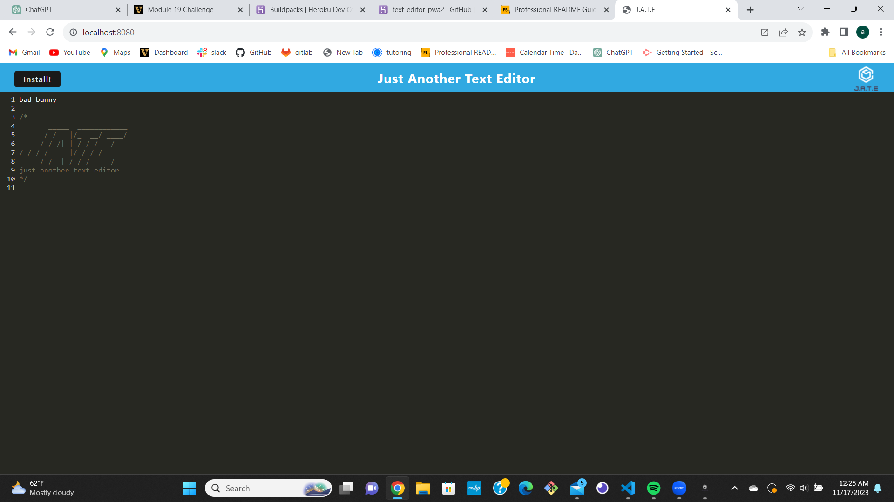

# Text-editor-PWA
## Description:
This progressive web application will show you how service workers and manifests enable users to download an application and continue usuing offline

## Installation
You will need Text Editing, PWA Compliance, Data Persistence, and Deployment. 

## Usage 
Open the application in your browser.
Create or load a document.
Edit the text content.
Save or download the document.

## Heroku 
In process 

## Contributing
I had lots of help from my tutor, and my TA